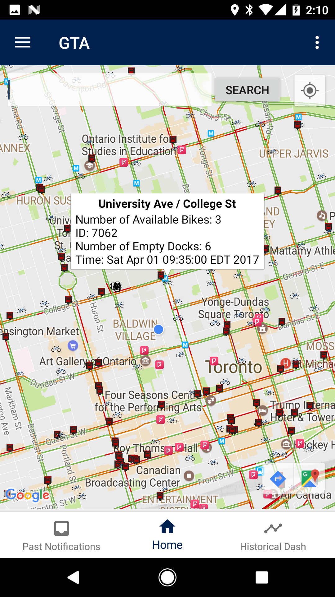
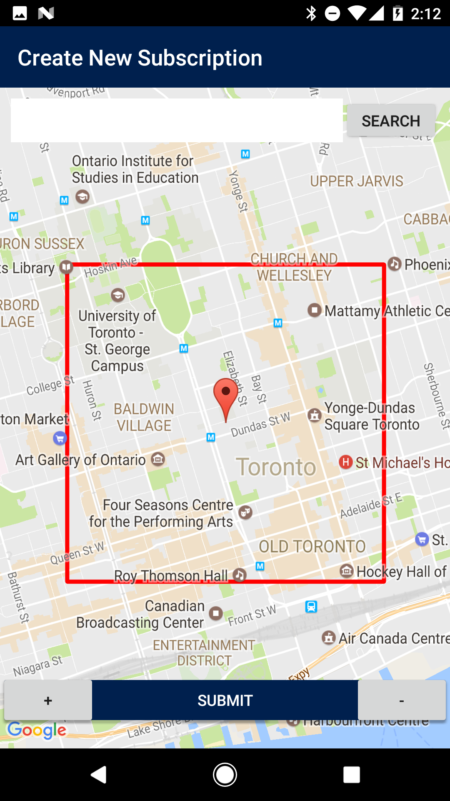
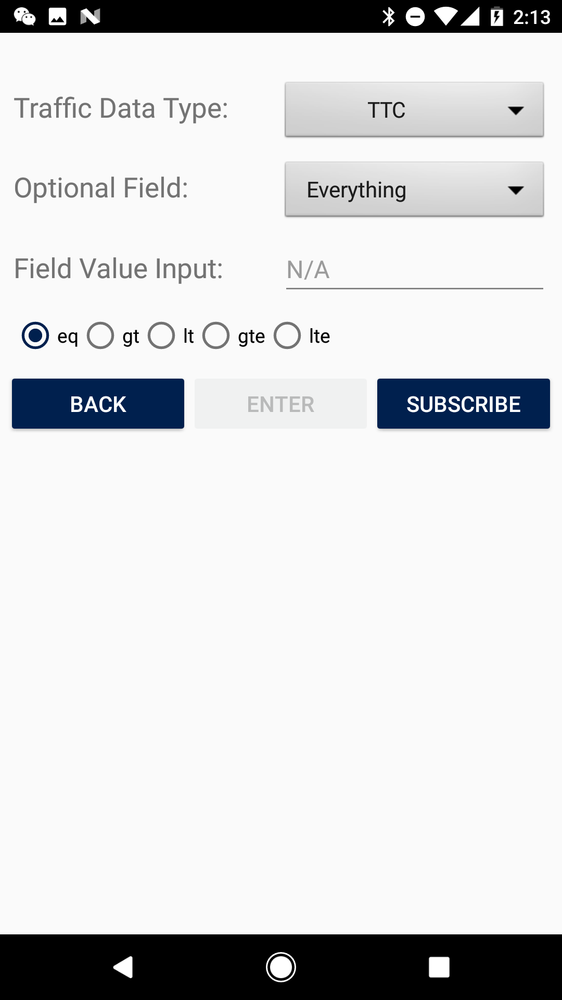
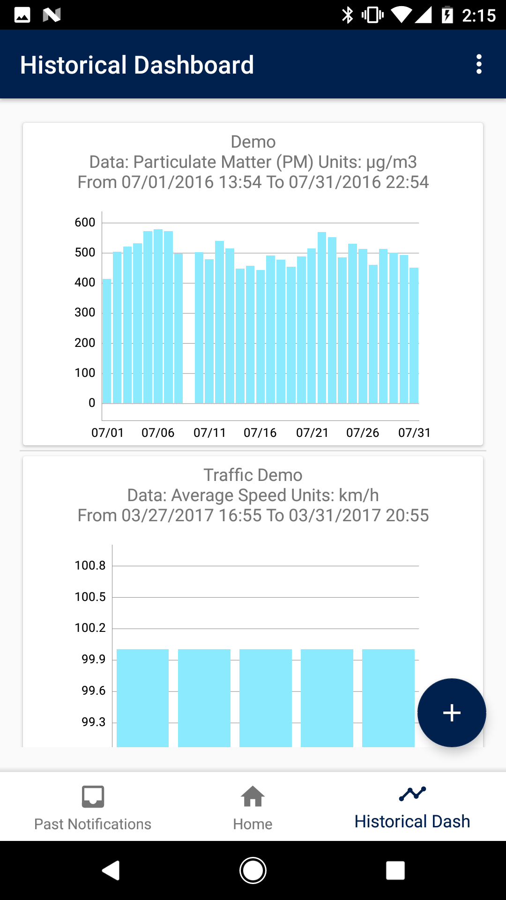

## CVST (Connected Vehicle Smart Transportation) for Android

Connected Vehicle Smart Transportation (CVST) aims at collecting and presenting traffic information generated from different sources, such as Google Maps and TTC real time alerts, in order to create a central traffic data repository to minimize blind spots across traffic data presented by the various providers. 

Currently, the only way to access data collected is through a desktop web application called the CVST portal. The CVST portal is problematic in that it causes mobile users to experience issues like difficulties to navigate, long response time and frequent crashes and that it lacks an intuitive and sophisticated subscription system for users.

This Android app for CVST that provides functionalities for users to search for CVST’s traffic events at different locations, subscribe to its traffic events of interests based on various criteria and view historical trends of its traffic events with the objectives of being fast, stable and easy to use.

## Screenshots

## Features
1. The Home Page provides users with real time CVST traffic data on a searchable, pannable and zoomable interactive map. 
2. Subscriptions. The app provides users with an intuitive subscription system where users can specify location of interest by resizable rectangle areas or intersections on the interactive map. 
3. The Past Notification page  maintains a record of past notifications and presents individual notifications visually on the interactive map. 
4. A Historical Dashboard that presents CVST’s historical traffic data trend in the form of graphs which can be customized by the users based on time range, location and data type. 

## Video Demo
